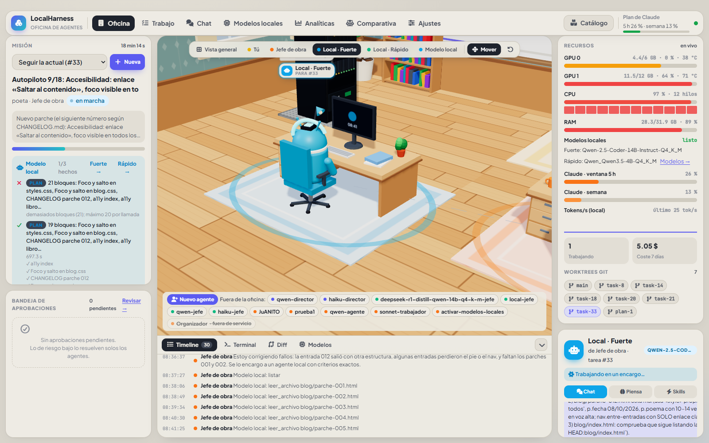
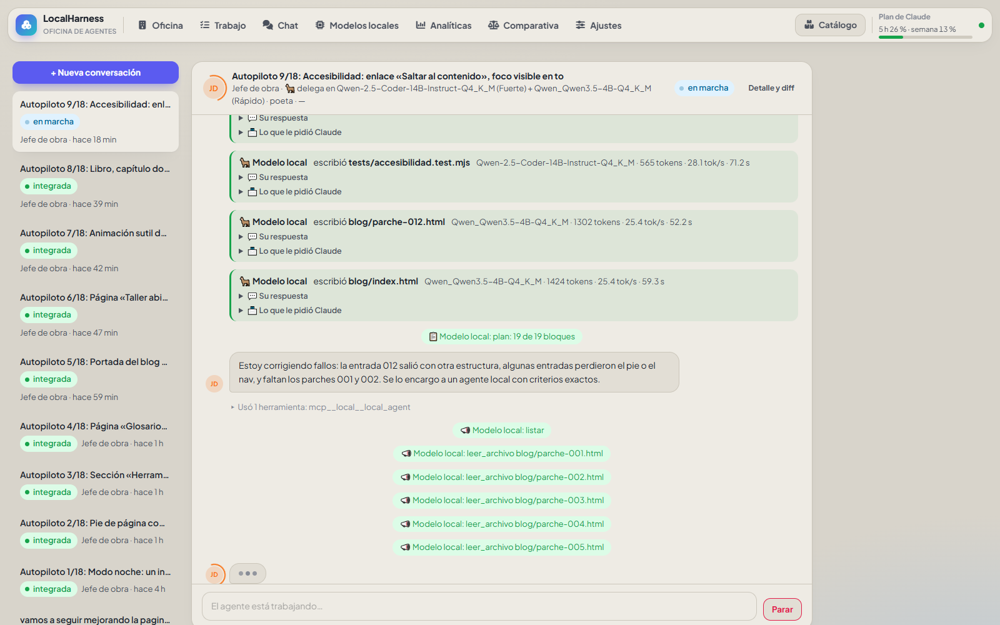
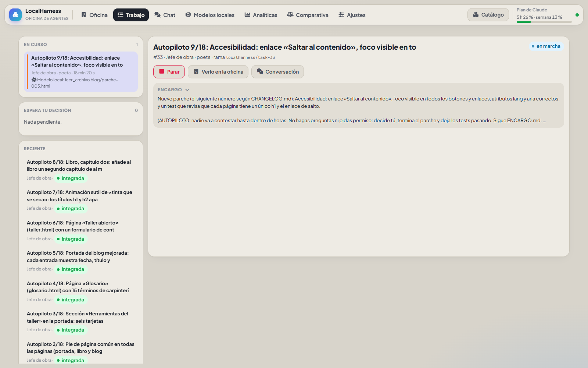
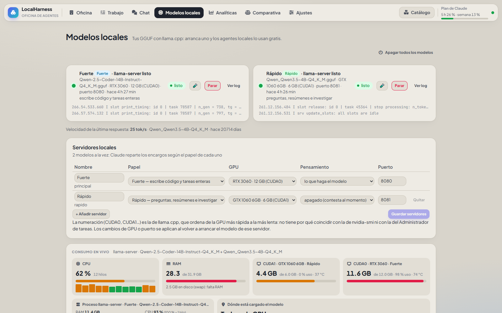
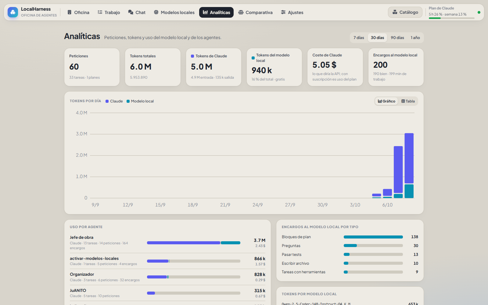
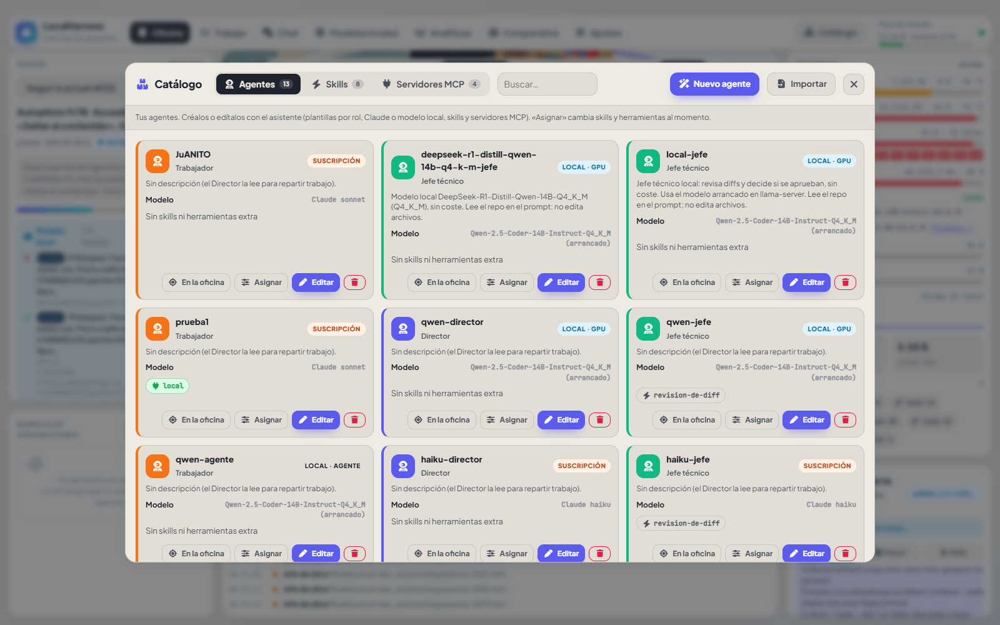
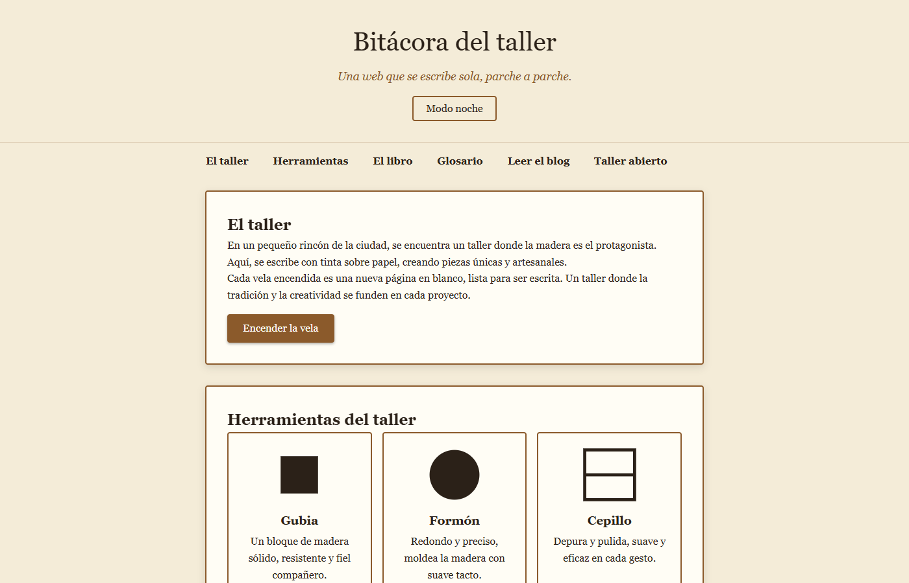

# LocalHarness

**Una oficina de agentes de programación que corre en tu PC.** Claude (por la CLI oficial, con tu suscripción)
planifica y revisa; tus modelos locales (llama.cpp, en una o varias GPU) escriben el código gratis. Cada tarea trabaja
en un **git worktree aislado** con su propia rama y tú decides qué se integra. Nunca hace push.


*Captura real (08/10/2026): el autopiloto va por el parche 9 de una web; Claude coordina y los dos modelos locales
(Qwen-2.5-Coder-14B en la RTX 3060 y Qwen3.5-4B en la GTX 1060) escriben. A la derecha, GPU, CPU, RAM y uso del plan.*

---

## Qué hace

### Claude coordina, los modelos locales trabajan
- **Delegación por MCP propio** (`localharness/mcp_local.py`): Claude encarga trabajo al modelo local con
  `local_ask`, `local_write_file`, `local_execute_plan`, `local_agent`, `local_research` y `run_checks`.
- **Modo coordinador**: el agente de Claude solo puede leer (`Read`/`Glob`/`Grep`), así que planifica y revisa;
  todo lo que se escribe lo escribe el modelo local.
- **Planes en paralelo**: `local_execute_plan` recibe el plan entero en bloques con dependencias (`after`). Los
  bloques independientes van a la vez, y al final pasa los tests.
- **Varias GPU, varios modelos**: un servidor llama.cpp por GPU (p. ej. «Fuerte» y «Rápido»). Cada bloque va al
  modelo **que esté libre**; el papel de cada modelo y la elección de Claude solo deciden en caso de empate.
- **Tests que ven el código**: un bloque de tests espera a los archivos que comprueba y los lee antes de escribirse.
- **Arreglo automático**: si los tests fallan, el modelo local decide qué archivo corregir y lo reescribe con el error
  delante (hasta 2 rondas) antes de devolvérselo a Claude.
- **Trabajador local equipado**: Claude elige con `local_prepare` las skills y herramientas del modelo local para cada
  tarea. Puedes cambiarlas desde la oficina mientras trabaja.

### Autopiloto
`Autopiloto.bat` (o `localharness autopilot`) hace sola **una lista de parches durante horas**, por ejemplo mientras
estás en clase:
- una tarea por parche;
- pasa los tests en el worktree; si pasan, aprueba e integra, y si no, pide **un** arreglo antes de descartar;
- vuelve a arrancar los modelos caídos;
- para por tiempo, por presupuesto o tras 3 fallos seguidos;
- relee la lista antes de cada parche, así que se puede alargar sin pararlo;
- si se reinicia a mitad, retoma la tarea viva;
- impide que Windows se suspenda;
- deja un informe Markdown con el resultado, el coste y lo que generó cada modelo local.

### La oficina (GUI web, Vue 3 + Three.js)
- **Oficina 3D**:
  - un puesto por agente y un robot por cada modelo local;
  - paquetes que van y vuelven entre Claude, el trabajador y el rack;
  - rack de CPD cuyos LEDs siguen el uso real;
  - puestos que se mueven y giran;
  - paneles de misión, recursos, inspector y timeline/terminal/diff.
- **Trabajo**: lo que está en curso en directo, lo que espera tu decisión y lo reciente. Revisión con riesgo, encargo,
  diff coloreado por archivo y los botones Aprobar e integrar / Solo aprobar / Descartar / Pedir cambios.
- **Chat**: conversaciones con un agente o con el equipo. Cada encargo al modelo local muestra qué le pidió Claude,
  cómo lo pensó el modelo y qué respondió, con tokens y tok/s.
- **Modelos locales**:
  - tu hardware y tus GGUF con su nota para LocalHarness;
  - descargas de Hugging Face;
  - diálogo de arranque (contexto, caché KV, capas o expertos en GPU, muestreo) con la VRAM estimada;
  - un panel por servidor, en qué GPU y cuánto de cada modelo está cargado, y su consumo en vivo.
- **Analíticas**: peticiones, tokens de Claude y del modelo local, coste nominal, encargos por tipo y por modelo, y
  uso por agente.
- **Comparativa**: la misma petición con Claude solo, con Claude más un modelo local y con Claude más todos, para
  medir cuánto plan se ahorra.
- **Catálogo**:
  - 27 skills en español;
  - 19 servidores MCP preparados;
  - plantillas de agente;
  - skills importadas desde GitHub;
  - un asistente para crear agentes (Claude Haiku, Sonnet u Opus, o un modelo local con el GGUF recomendado para
    el rol);
  - «Agente a medida»: Claude Haiku diseña el agente que mejor encaja con cada tarea.

### Equipo y flujo git
- **Director → plan → trabajadores → jefe técnico → tú**: el Director descompone una petición grande y los
  trabajadores la hacen paso a paso. Las reglas deterministas del diff dan a cada paso un nivel de riesgo:
  - N0: se integra solo;
  - N1: lo revisa el jefe técnico;
  - N2: llega a tu bandeja.
- Una rama y un worktree por tarea, con detección de conflictos antes de integrar y limpieza de lo ya cerrado.
- Skills (`SKILL.md`) y memoria por proyecto inyectadas en el prompt.
- La API solo atiende a peticiones locales (Host/Origin); la CLI de Claude va aislada y con topes de turnos y de $.

## Capturas

| | |
|---|---|
|  **Chat**: cada encargo al modelo local, con el modelo, los tokens, los tok/s y el tiempo |  **Trabajo**: en curso, pendiente de ti y lo integrado |
|  **Modelos locales**: dos servidores llama.cpp, uno por GPU, con papel, pensamiento y consumo en vivo |  **Analíticas**: tokens de Claude frente a los locales, coste y uso por agente |
|  **Catálogo**: agentes, skills y servidores MCP |  **Lo que sale**: la web «Bitácora del taller» construida por los modelos locales en el autopiloto (los dibujos de las herramientas son un cuadrado y un círculo: el diseño visual es lo más flojo) |

## Un caso real: el autopiloto del 08/10/2026

Lista de parches para una web estática (proyecto `poeta`), coordinada por Claude Sonnet («Jefe de obra») con
Qwen-2.5-Coder-14B en la RTX 3060 y Qwen3.5-4B en la GTX 1060. Datos de los 7 primeros parches:

| | |
|---|---|
| Parches integrados | 7 de 7, con los tests pasando |
| Coste nominal de Claude | 1,32 $ (unos 0,19 $ por parche; con suscripción es uso del plan) |
| Líneas escritas por Claude | 0: los 81 encargos de escritura los hizo el modelo local |
| Velocidad real | ~27–31 tok/s el 14B y ~25 tok/s el 4B |
| Lo que más tiempo perdía | Tests que adivinaban el marcado (5 de 7 primeras rondas) y `local_agent` atascado releyendo archivos |

De ese análisis salieron el reparto por cola, los tests que esperan a su código y el arreglo automático de arriba.

## Instalación y arranque

En Windows, lo más fácil:
- `LocalHarness.bat`: la primera vez prepara el entorno; después arranca el servidor y abre el navegador.
- `Crear acceso directo.bat`: crea un icono en el escritorio y en el menú Inicio.
- `Actualizar.bat`: actualiza.

A mano (Python 3.10 o superior; en Windows con la Store, `py -3.12`):
```
py -3.12 -m venv .venv && .venv/Scripts/python -m pip install -e .[server]   # una vez
cd web && npm install && npm run build && cd ..                                # la web, una vez y tras cambiarla
.venv/Scripts/python -m localharness doctor     # git, CLIs, login de suscripción
.venv/Scripts/python -m localharness start      # servidor + navegador en http://127.0.0.1:8095
```
- **Claude**: hace falta la CLI `claude` con la sesión iniciada.
- **Modelos locales**: hace falta [llama.cpp](https://github.com/ggml-org/llama.cpp) (`llama-server`). La pestaña
  Modelos locales lo arranca y lo para.

Sin uno de los dos, todo lo demás sigue funcionando.

Pruebas (220, con CLIs y llama-server falsos: nunca llaman a la CLI real):
```
.venv/Scripts/python -m unittest discover -s tests -t .
```

## Uso por CLI

`lh` = `.venv/Scripts/python -m localharness`

| Orden | Qué hace |
|---|---|
| `lh start` · `lh serve` | GUI en http://127.0.0.1:8095 (`start` además abre el navegador) |
| `lh project add <nombre> <ruta>` · `lh agent add …` | Registrar repos y agentes |
| `lh run <proyecto> "<petición>" --agent X` | Una tarea en su worktree |
| `lh tasks` · `show <id> --diff` · `merge <id>` · `discard <id>` | Revisar, integrar (pide confirmación, nunca push) o descartar |
| `lh plan new <proyecto> "<petición>" --director X` | Director → plan → trabajadores → jefe técnico |
| `lh plan inbox` · `plan decide <tarea> --approve\|--reject` | Lo que espera tu decisión |
| `lh autopilot --project P --agent A --list lista.md` | Lista de parches durante horas (ver `Autopiloto.bat`) |
| `lh llama models\|serve <modelo>\|status` | Modelos GGUF y llama-server |
| `lh probar-delegacion` | Prueba gratis (sin Claude) de que el modelo local recibe encargos, escribe y pasa tests |
| `lh sandbox [--reset]` | Repo de pruebas con fallos a propósito y agentes ya creados |
| `lh skills` · `lh cleanup [--dry-run]` | Catálogo de skills · borrar worktrees y ramas de lo cerrado |

## Mapa del código

| Archivo | Qué hace |
|---|---|
| `localharness/api.py` | FastAPI + SSE: proyectos, agentes, tareas, planes, modelos locales, analíticas, comparativas |
| `localharness/orchestrator.py` | Ciclo de una tarea: worktree → agente → checkpoint → revisión; delegación MCP y directo |
| `localharness/mcp_local.py` | Servidor MCP propio: encargos al modelo local, planes en paralelo, reparto por cola, arreglo automático |
| `localharness/autopilot.py` | El autopiloto de parches |
| `localharness/hierarchy.py` · `policy.py` | Director, trabajadores, jefe técnico y niveles N0/N1/N2 |
| `localharness/adapters/` | Un adaptador por proveedor: `claude.py` (CLI), `local.py` (un mensaje) y `local_agent.py` (bucle con herramientas en el worktree) |
| `localharness/llama.py` · `local_servers.py` · `hardware.py` | llama-server: arranque por GPU, claves, carga, autoarranque y estimación de VRAM |
| `localharness/compare.py` · `analytics.py` · `usage.py` | Comparativa, analíticas y consumo en vivo |
| `localharness/designer.py` · `library.py` · `catalog.py` | Agentes a medida, biblioteca del Catálogo y nota de cada GGUF |
| `localharness/workspace.py` · `actions.py` · `maintenance.py` | Ramas, worktrees, merge con detección de conflictos y limpieza |
| `localharness/store.py` · `settings.py` | SQLite con migraciones y ajustes editables desde la GUI |
| `web/` | Vue 3 + Vite + Three.js: Oficina, Trabajo, Chat, Modelos locales, Analíticas, Comparativa, Ajustes, Catálogo |
| `manual/director.md` · `roles/` · `skills/` · `biblioteca/` | Comportamiento del Director, roles, skills propias y biblioteca |

## Documentación

| Documento | Para qué |
|---|---|
| [`docs/GUIA.md`](docs/GUIA.md) | Funciones e implementación: conceptos, proveedores, jerarquía, git, API, eventos y configuración |
| [`docs/ESTADO.md`](docs/ESTADO.md) | Estado y traspaso entre sesiones: leer primero al retomar |
| [`docs/OBJETIVOS.md`](docs/OBJETIVOS.md) · [`docs/HOJA-DE-RUTA.md`](docs/HOJA-DE-RUTA.md) | Rumbo, decisiones cerradas e hitos |
| [`docs/DISENO-OFICINA.md`](docs/DISENO-OFICINA.md) | Diseño de la oficina y de cómo se comunican los agentes |
| [`docs/REVISION.md`](docs/REVISION.md) | Revisión completa: lo que está bien, lo arreglado y lo que falta |
| [`docs/INSTALAR.md`](docs/INSTALAR.md) · [`docs/PROBAR.md`](docs/PROBAR.md) | Instalación y pruebas manuales con el sandbox |
